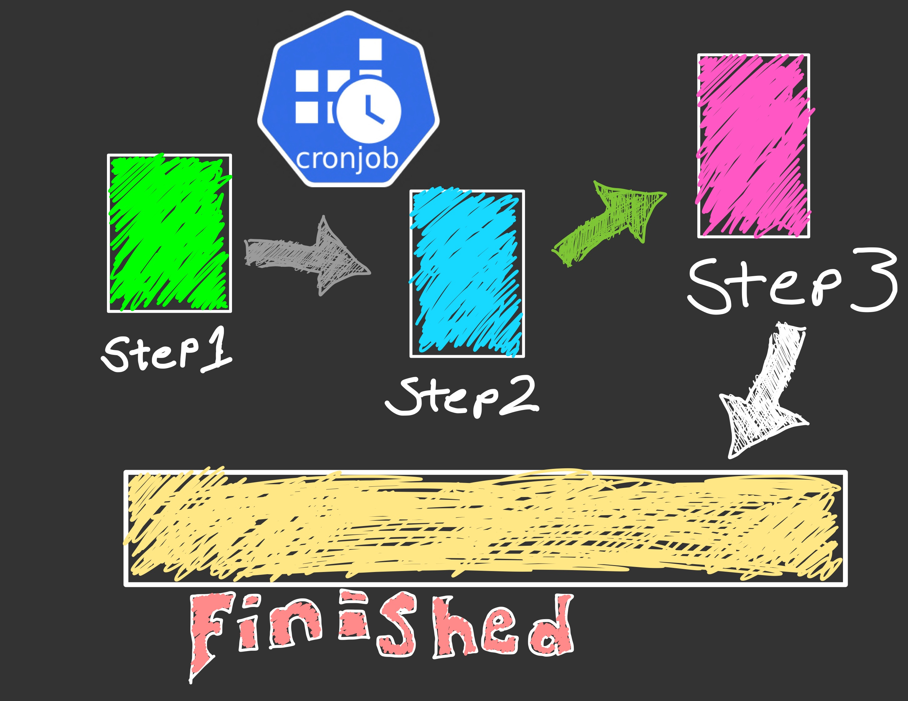
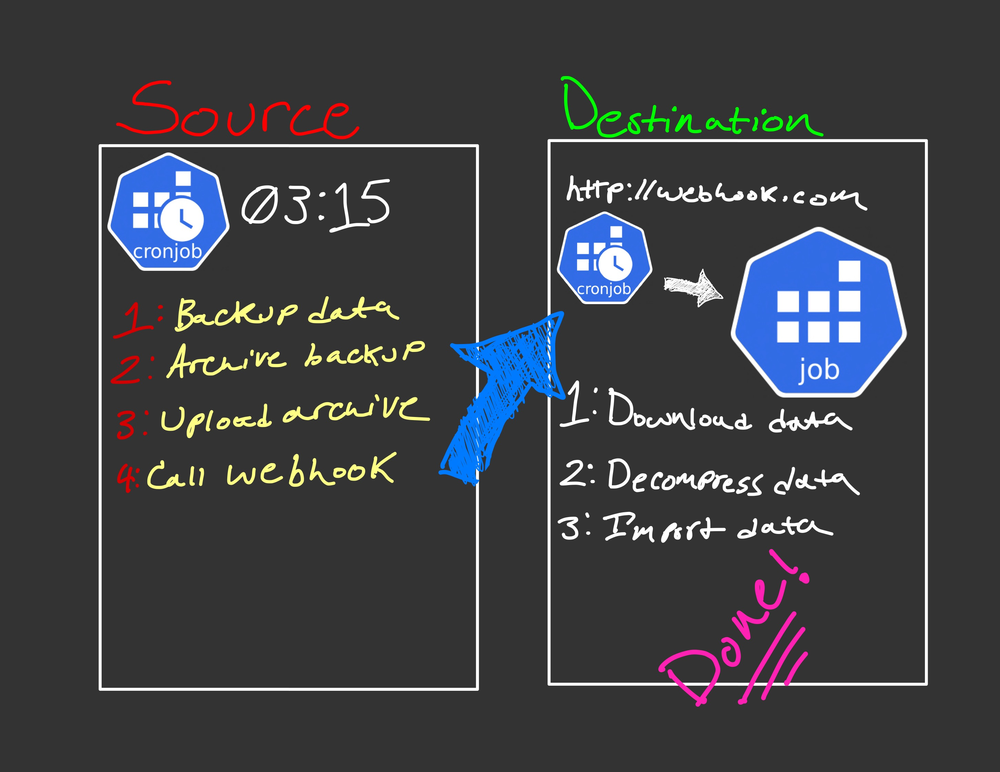

# 0328-multi-step-pods-and-jobs

This is the source code for the YouTube video titled `0328 - Multi Step Pods & Jobs`

These examples use Kubernetes `initContainers` to execute a series of steps in Kubernetes. For many tasks, you don't need anything complicated.

## Steps - Example

1. Create archive
1. Decompress archive
1. Process data

## Steps - Real World

I have a production use case that consists of two `cronjobs` on two different clusters.
 

### On the source cluster

> This is scheduled to run nightly with `schedule: "15 3 * * *"`

1. Collect data from internal APIs and databases
1. Compress these files
1. Upload the archive to AWS S3 as `nightly_data_2022_03_28.tar.gz` and `nightly_data_latest.tar.gz`
1. Call webhook running on the destination cluster to trigger the second half

### On the destination cluster

> This cronjob is NOT actively scheduled. It is suspended with `suspend: true`.
Unscheduled `cronjob`s can be used to create `jobs` on demand.

1. Webhook is triggered
1. `kubectl create job --from=cj/nightly-import nightly-import-2022-03-28`
1. Multi Step Job
    1. Pull data from `s3://fake-bucket/nightly_data_latest.tar.gz`
    1. Decompress the data
    1. Run analytics on the data